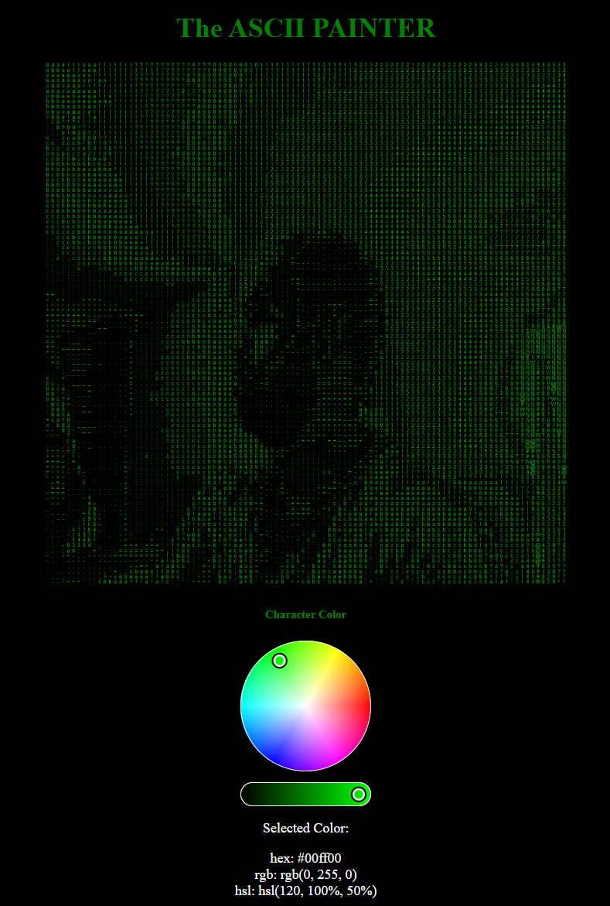

# IAMGE TO ASCII

[](https://github.com/RichardLitt/standard-readme)


## Table of Contents

- [Background](#background)
- [Install](#install)
- [Live Demo](#live-demo)
- [Resources](#Resources)
- [License](#license)

## Background
This repo is inspired by the the recent [Coding Challenge by Danniel Shiffman](https://www.youtube.com/watch?v=55iwMYv8tGI), where he  demonstrates a variety of techniques for translating the pixels of an image into text.
In my version of the challenge, I added a color blender, giving user more control over the color theme to be used for the rendering.


## Install

1. Clone this repo to your machine.

```sh
$ git clone https://github.com/Ozeidi/ASCII_ART.git
```
2. To test the code, I highly recommend using VS Code. I use `Live Server` extension to serve the app locally.


## Live Demo
- [P5 Editor](https://editor.p5js.org/ozeidi91/sketches/qJOUN5rLl)
##  Resources
- [THE CODING TRAIN](https://thecodingtrain.com/CodingChallenges/166-ascii-image.html):Image to Ascii, Coding Challenge #166.
- [The Coding Train Youtube Channel](https://www.youtube.com/c/TheCodingTrain/featured): Daniel Shiffman Coding Train channel is dedicated to beginner-friendly creative coding tutorials and challenges. 
## License

[MIT](LICENSE) © Omar Al Zeidi
{"mode":"full","isActive":false}